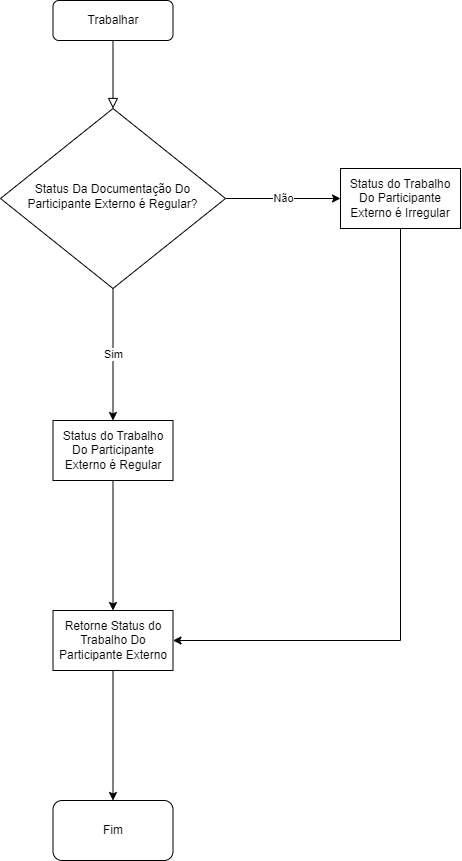
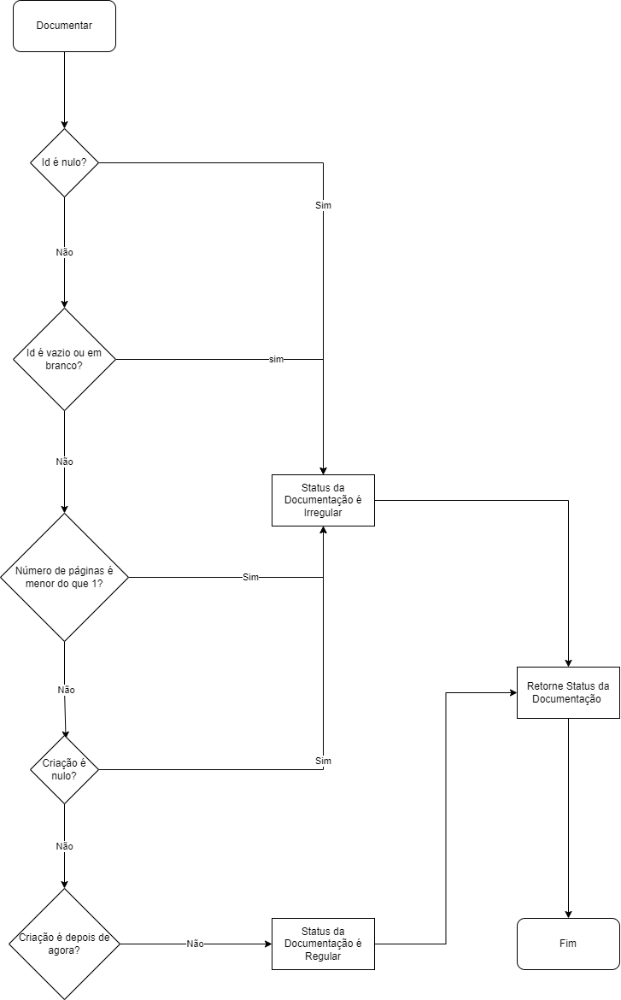

# ERP

## Diagrama de Classes UML

## 5W2H

**1. What?**

ERP (Enterprise Resource Planning - Planejamento de Recursos Empresariais) para uma empresa fictícia.

**2. Why?**

Para praticar as seguintes competências:

-   Java
-   Orientação a Objetos (OOP/POO)
-   APIs Rest
-   Spring Boot
-   Testes unitários
-   JUnit
-   Maven
-   MySQL
-   JDBC
-   Clean Code
-   Git
-   GitHub

**3. Who?**

[🙋‍♂️](https://github.com/andre-alck)

**4. Where?**

API será hospedada no Google App Engine.

**5. When?**

Tempo indefinido, considerando a premissa do projeto: prática de competências.

**6. How?**

Utilizando as competências listadas na seção "2. Why?".

**7. How Much?**

Custo variável, dependendo da tabela de preços atual do Google App Engine para hospedagem da aplicação. Para mais informações, [verificar documentação das cotas](https://cloud.google.com/1ppengine/docs/standard/quotashl=pt-br).

## Regras de Negócio

### Participante Externo

-   Ao **trabalhar**, deve **retornar** Status Do Trabalho, como consta Fluxograma abaixo.

    

    Onde:

    -   Status Da Regulamentação Do Participante Externo:
        1. Regular.
        2. Aguardando Envio Por Parte do Participante Externo.
        3. Aguardando Análise Interna.
    -   Status Do Trabalho:
        1. Regular.
        2. Irregular.

### Estagiário

-   Ao **documentar**, deve **retornar** Status Do Trabalho, como consta Fluxograma abaixo.

    

    Onde:

    -   Todo Estagiário segue as mesmas regras para documentação (independentemente se é, de fato, única e exclusivamente um Estagiário).

## Design Pattern

-   Builders
